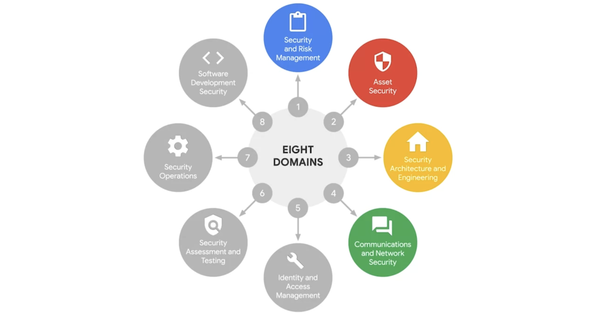

## CISSP Security Domains Part 1

### Introduction

*   CISSP identifies eight security domains used by security teams for organizing tasks and identifying security gaps.

*   These domains help establish an organization's security posture, referring to its ability to manage defense of critical assets and data and react to change.

### 1. Security and Risk Management

*   **Focus Areas:**

    *   Defining security goals and objectives

    *   Risk mitigation

    *   Compliance

    *   Business continuity

    *   Legal regulations

*   **Details:**

    *   Defining security goals and objectives reduces risks to critical assets like PII.

    *   **Risk mitigation** involves having procedures in place to quickly reduce risk impacts.

    *   **Compliance** involves developing internal security policies, regulatory requirements, and independent standards.

    *   **Business continuity** relates to maintaining productivity through risk disaster recovery plans.

    *   Following ethical rules and expectations minimizes negligence, abuse, or fraud.

### 2. Asset Security

*   **Focus:**

    *   Securing digital and physical assets

    *   Storage, maintenance, retention, and destruction of data

*   **Details:**

    *   Assets such as PII or SPII should be securely handled and protected.

    *   Policies and procedures ensure data is properly stored, maintained, retained, and destroyed.

    *   Security analysts may oversee destruction of hard drives to prevent access by threat actors.

### 3. Security Architecture and Engineering

*   **Focus:**

    *   Optimizing data security with effective tools, systems, and processes

    *   Shared responsibility for lowering risk and maintaining security

*   **Details:**

    *   Secure design architecture emphasizes shared responsibility among all individuals.

    *   Policies encourage users to recognize and report security concerns for quick resolution.

### 4. Communication and Network Security

*   **Focus:**

    *   Managing and securing physical networks and wireless communications

*   **Details:**

    *   Secure networks protect data and communications on-site, in the cloud, and during remote connections.

    *   Employees in public spaces need protection from vulnerabilities in insecure connections like bluetooth or public wifi.

    *   Security team members remove access to insecure communication channels to discourage insecure behavior.

### Conclusion

*   The first four domains cover crucial aspects of security and risk management, asset protection, secure architecture, and communication and network security.

*   These domains are essential for maintaining a robust security posture and addressing potential security threats effectively.
