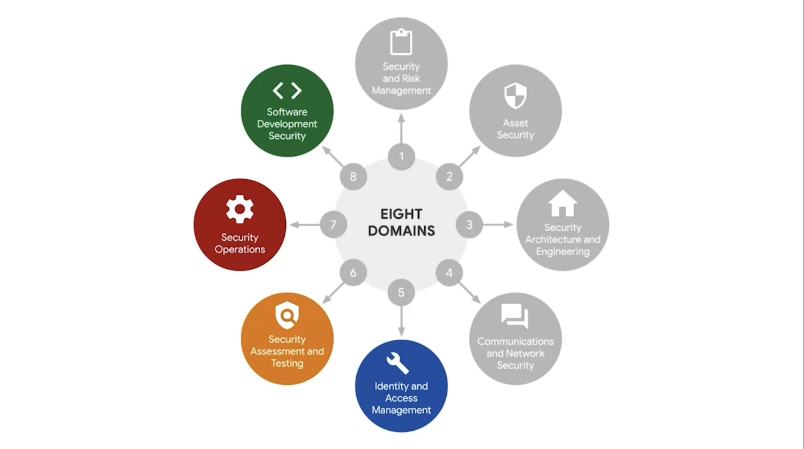

## CISSP Security Domains Part 2

### 5. Identity and Access Management (IAM)

- **Focus:**
  - Access and authorization to ensure data security
  - Control and manage user access based on established policies
- **Details:**
  - Essential to limit user access to what employees need, reducing overall risk to systems and data.
  - Components: Identification, Authentication, Authorization, Accountability.
  - Identification: User verifies identity with username, access card, or biometric data.
  - Authentication: Process to prove a person's identity, like entering a password.
  - Authorization: Determines user's level of access based on role in the organization.
  - Accountability: Monitoring and recording user actions to ensure proper system and data usage.

### 6. Security Assessment and Testing

- **Focus:**
  - Conducting security control testing, data collection, analysis, and audits
  - Monitoring for risks, threats, and vulnerabilities
- **Details:**
  - Helps identify new ways to mitigate threats, risks, and vulnerabilities.
  - Evaluates if controls achieve organizational goals and objectives.
  - Regular data collection and analysis prevent threats and risks.

### 7. Security Operations

- **Focus:**
  - Conducting investigations and implementing preventive measures
  - Neutralizing threats and minimizing potential risks
- **Details:**
  - Investigations begin after identifying a security incident.
  - Collection of digital and physical evidence for forensic investigation.
  - Helps determine areas for improvement and preventive measures.

### 8. Software Development Security

- **Focus:**
  - Using secure coding practices throughout the software development lifecycle
- **Details:**
  - Secure coding practices ensure creation of secure applications and services.
  - Integrates security into every phase of the software development lifecycle.
  - Includes secure design review, code reviews, and penetration testing.

### Conclusion

- Understanding these domains helps improve overall security and highlights the critical role of security teams.
- Security professionals play a vital role in protecting organizations from threats, risks, and vulnerabilities, such as ransomware.