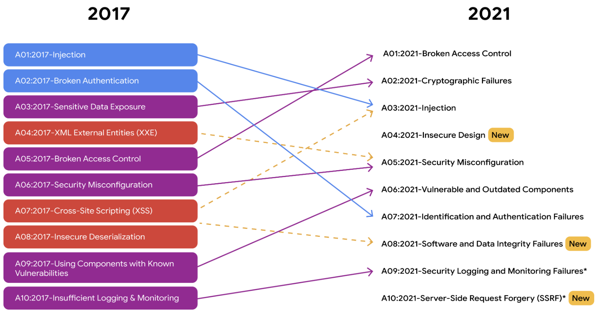

**Risk Management Strategies and Frameworks:**

1. **Acceptance:** Accepting a risk to avoid disrupting business continuity.
2. **Avoidance:** Creating a plan to avoid the risk altogether.
3. **Transference:** Transferring risk to a third party to manage.
4. **Mitigation:** Lessening the impact of a known risk.

**Common Types of Threats:**

- **Insider Threats:** Authorized individuals abusing access to harm the organization.

- **Advanced Persistent Threats (APTs):** Threat actors maintain unauthorized access over an extended period.

- **External Risk:** Threats from outside the organization attempting to gain access.

- **Internal Risk:** Current or former employees, vendors, or partners posing a security risk.

- **Legacy Systems:** Old systems that can still impact assets.

- **Multiparty Risk:** Risks associated with outsourcing to third-party vendors.

- **Software Compliance/Licensing:** Risks related to outdated or non-compliant software.

  

**Common Vulnerabilities:**

- **ProxyLogon:** Pre-authenticated vulnerability affecting Microsoft Exchange server.
- **ZeroLogon:** Vulnerability in Microsoft's Netlogon authentication protocol.
- **Log4Shell:** Allows attackers to run Java code or leak sensitive information.
- **PetitPotam:** Affects Windows NTLM authentication protocol.
- **Security Logging and Monitoring Failures:** Insufficient logging and monitoring capabilities.
- **Server-side Request Forgery:** Manipulates server-side applications to access backend resources.

**Key Takeaways:**

- Understanding risk management strategies and frameworks is essential for developing organization-wide policies.
- Familiarity with common threats, risks, and vulnerabilities enables better protection and mitigation efforts.
- Continuous monitoring and proactive patching are crucial for vulnerability management.

**Resources:**

- [OWASP Top Ten](https://owasp.org/www-project-top-ten/)
- [NIST RMF](https://www.nist.gov/cybersecurity/risk-management-framework)