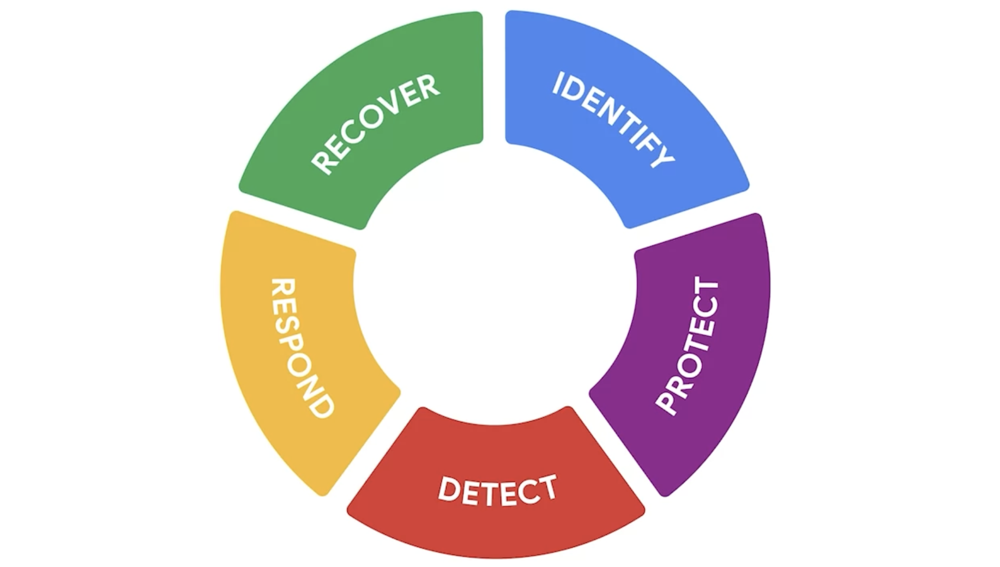

## Explore the Five Functions of the NIST Cybersecurity Framework

### Introduction
- Focus on the five core functions of the NIST Cybersecurity Framework (CSF).
- These core functions help organizations manage cybersecurity risks, implement risk management strategies, and learn from previous mistakes.

### The Five Core Functions

#### 1. Identify
- **Purpose:** Manage cybersecurity risk and its effect on an organization's people and assets.
- **Example:** Monitoring systems and devices in an organization's internal network to identify potential security issues.

#### 2. Protect
- **Purpose:** Implement policies, procedures, training, and tools to protect an organization and mitigate cybersecurity threats.
- **Example:** Studying historical data and making improvements to policies and procedures to handle new and unfamiliar threats and attacks.

#### 3. Detect
- **Purpose:** Identify potential security incidents and improve monitoring capabilities to increase detection speed and efficiency.
- **Example:** Reviewing the setup of a new security tool to ensure it flags and alerts the security team about low, medium, or high-risk incidents.

#### 4. Respond
- **Purpose:** Ensure proper procedures are used to contain, neutralize, and analyze security incidents, and implement improvements to the security process.
- **Example:** Collecting and organizing data to document an incident and suggesting process improvements to prevent recurrence.

#### 5. Recover
- **Purpose:** Return affected systems back to normal operation.
- **Example:** Working with a security team to restore systems, data, and assets (e.g., financial or legal files) affected by an incident like a breach.

### Conclusion
- **Key Points:**
  - The five core functions are essential for effective security strategies.
  - Organizations must have proactive and reactive measures in place to handle security incidents.
  - The ability to quickly recover from incidents minimizes organizational risk.

- 