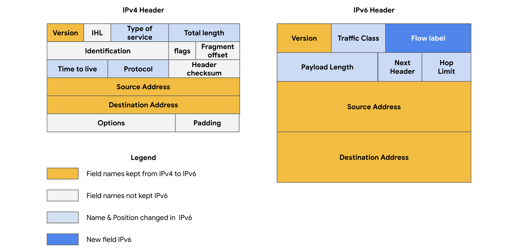

# Components of Network Layer Communication

In the reading about the OSI model, you learned about the seven layers of the OSI model that are used to conceptualize the way data is transmitted across the internet. In this reading, you will learn more about operations that take place at layer 3 of the OSI model: the network layer.

## Operations at the Network Layer
Functions at the network layer organize the addressing and delivery of data packets across the network from the host device to the destination device. This includes directing the packets from one router to another across the internet until they reach the internet protocol (IP) address of the destination network. The destination IP address is contained within the header of each data packet. This address will be stored for future routing purposes in routing tables along the packet’s path to its destination.

All data packets include an IP address. A data packet is also referred to as an IP packet for TCP connections or a datagram for UDP connections. A router uses the IP address to route packets from network to network based on information contained in the IP header of a data packet. Header information communicates more than just the address of the destination. It also includes information such as the source IP address, the size of the packet, and which protocol will be used for the data portion of the packet.

## Format of an IPv4 Packet
An IPv4 packet is divided into two parts: the header and the data.

### IPv4 Header
- **Header Length**: 20 to 60 bytes.
- **Fixed Information (20 bytes)**: Includes the source and destination IP address, header length, and total length of the packet.
- **Options Field (0 to 40 bytes)**: Can include various options.

### IPv4 Data
- **Length**: Varies greatly in size, with a maximum possible size of 65,535 bytes.
- **Content**: Contains the message being transferred over the internet, such as website information or email text.

### Diagram of an IPv4 Packet Header
An IPv4 packet header contains 13 fields:

1. **Version (VER)**: 4-bit component indicating the protocol version (IPv4).
2. **IP Header Length (HLEN or IHL)**: Indicates where the packet header ends and the data segment begins.
3. **Type of Service (ToS)**: Provides the router with information on packet prioritization.
4. **Total Length**: Total length of the entire IP packet, including the header and data.
5. **Identification**: Unique identifier for all fragments of the original IP packet.
6. **Flags**: Indicates whether the packet has been fragmented and if there are more fragments.
7. **Fragmentation Offset**: Specifies the position of the fragment within the original packet.
8. **Time to Live (TTL)**: Prevents data packets from being forwarded indefinitely by routers.
9. **Protocol**: Indicates the protocol used for the data portion of the packet.
10. **Header Checksum**: Used to detect corruption of the IP header in transit.
11. **Source IP Address**: IPv4 address of the sending device.
12. **Destination IP Address**: IPv4 address of the destination device.
13. **Options**: Allows for security options if the HLEN value is greater than five.

## Difference Between IPv4 and IPv6

### IPv4
- **Format**: Four decimal numbers separated by periods (e.g., 198.51.100.0).
- **Length**: 4 bytes, allowing for up to 4.3 billion possible addresses.

### IPv6
- **Format**: Eight hexadecimal numbers separated by colons (e.g., 2002:0db8::ff21:0023:1234).
- **Length**: 16 bytes, allowing for up to 340 undecillion addresses.
- **Advantages**: More efficient routing, eliminates private address collisions, and includes a simpler header format.

### Security Differences
- **IPv6**: Offers more efficient routing and eliminates private address collisions that can occur on IPv4 when two devices on the same network attempt to use the same address.

## Key Takeaways
Analyzing the different fields in an IP data packet can provide important security information about the packet. This includes:
- **Source and Destination**: Where the packet is coming from and where it’s going.
- **Protocol**: Which protocol is being used.
- **Security Implications**: Understanding the data in an IP data packet allows for critical decisions about the security implications of packets that are inspected.

Understanding these components is crucial for network security professionals to effectively monitor, secure, and troubleshoot network communication.