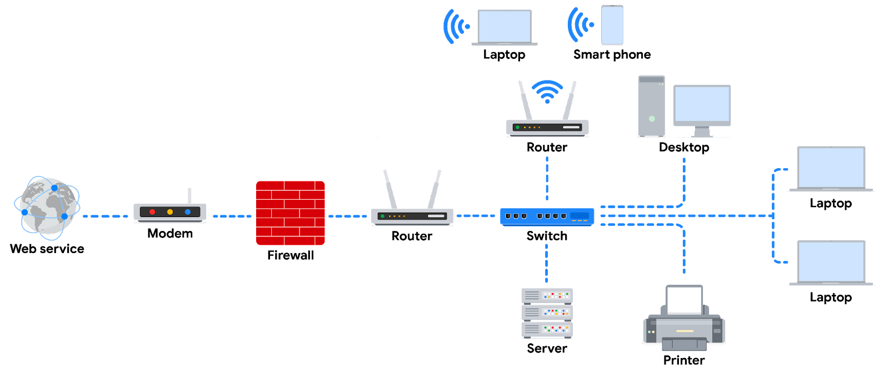

# Network Components, Devices, and Diagrams

## Introduction
Understanding network architecture, also known as network design, is fundamental for identifying security vulnerabilities and how malicious actors may exploit them. This reading covers network devices, their connections, and a simple network diagram similar to those used by network security professionals.

## Network Devices
Network devices maintain information and services for network users. These devices connect over wired and wireless connections, sending data packets that provide information about the data's source and destination.

### Key Network Devices
- **Routers**: Direct traffic between networks.
- **Switches**: Connect devices on a network and direct data packets to their intended destination.
- **Hubs**: Provide a common connection point for devices but are less secure as they broadcast data to all connected devices.
- **Modems**: Connect the network to an ISP and convert digital signals to analog for transmission over physical connections.
- **Firewalls**: Monitor and control incoming and outgoing network traffic based on security rules.
- **Servers**: Provide information and services to client devices.
- **Wireless Access Points**: Send and receive digital signals over radio waves to create a wireless network.

### Network Diagram Components
In a typical network diagram:
- **Router**: Connects to the internet through a modem provided by the ISP.
- **Firewall**: Monitors incoming and outgoing traffic.
- **Devices**: Computers, laptops, smartphones, tablets, and printers connect to the network.
- **Switch**: Optional device for connecting more devices by providing additional ports.
- **Server**: Provides services accessible by all devices on the network.
- **Load Balancing Routers**: Improve network performance by distributing traffic.

## Device Details

### Devices and Desktop Computers
- **Unique Identifiers**: Each device has a unique MAC address and IP address.
- **Network Interface**: Sends and receives data packets, connecting via hard wire or wireless connection.

### Firewalls
- **Function**: First line of defense monitoring traffic and restricting specific network traffic.
- **Placement**: Reside between secured internal network and untrusted external networks like the internet.

### Servers
- **Client-Server Model**: Clients request information/services from the server, which performs the requests.
- **Examples**: DNS servers, file servers, corporate mail servers.

### Hubs and Switches
- **Hub**: Repeats information to all ports, making it less secure and more prone to eavesdropping.
- **Switch**: Forwards packets to intended devices, maintains a MAC address table, improves performance and security.

### Routers
- **Function**: Connects networks, directs traffic based on destination IP addresses.
- **Layer**: Part of the network layer in the TCP/IP model.
- **Additional Feature**: Can include firewalls to block malicious traffic.

### Modems and Wireless Access Points
- **Modem**: Connects network to ISP, translates digital signals to analog.
- **Wireless Access Point**: Creates a wireless network using Wi-Fi protocols, sending data through radio waves.

## Using Network Diagrams
Network diagrams are maps showing network devices and their connections, using representative graphics and dotted lines. They help security analysts visualize and secure network architectures.

## Key Takeaways
- **Client-Server Model**: Clients request information and services from servers.
- **Network Devices**: Include routers, switches, workstations, servers, hubs, and modems.
- **Network Diagrams**: Used by security analysts to visualize and secure network architecture.

## Resources
- [National Institute of Standards and Technology (NIST) - Network Security](https://www.nist.gov/network-security)
- [Cisco - Understanding Network Diagrams](https://www.cisco.com/network-diagrams)