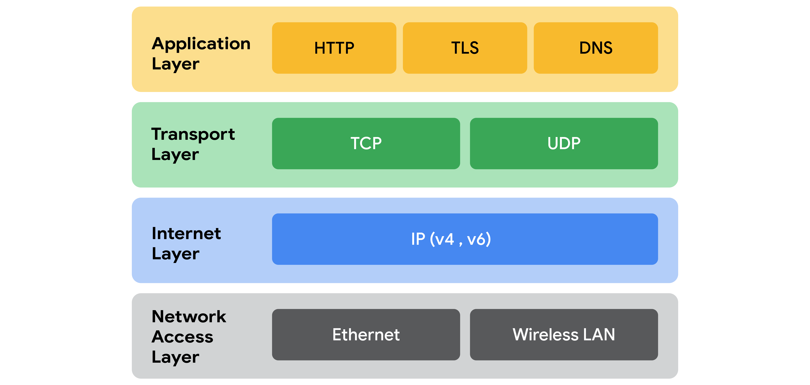

# Learn More About the TCP/IP Model

## Overview
In this reading, you'll build on your understanding of the Transmission Control Protocol/Internet Protocol (TCP/IP) model, explore the differences between the TCP/IP and Open Systems Interconnection (OSI) models, and review each layer of the TCP/IP model along with common protocols used in each layer.

## Importance of the TCP/IP Model
- **Purpose**: Describes functions of various network protocols.
- **Basis**: Based on the TCP/IP protocol suite.
- **Network Protocol**: A set of standards for routing and addressing data packets between devices on a network.

## TCP/IP Model Overview
- **Framework**: Used to visualize how data is organized and transmitted across a network.
- **Layers**: Network access layer, Internet layer, Transport layer, Application layer.
- **Usage**: Helps network engineers and security analysts conceptualize processes and communicate disruptions or threats.

## The Four Layers of the TCP/IP Model

### 1. Network Access Layer
- **Also Known As**: Data link layer.
- **Function**: Deals with the creation of data packets and their transmission across a network.
- **Components**:
  - Physical hardware (hubs, modems, cables, wiring).
  - **Address Resolution Protocol (ARP)**: Maps IP addresses to MAC addresses for local network communication.

### 2. Internet Layer
- **Also Known As**: Network layer.
- **Function**: Ensures delivery to the destination host, attaches IP addresses to data packets.
- **Common Protocols**:
  - **Internet Protocol (IP)**: Sends data packets to the correct destination, relies on TCP/UDP.
  - **Internet Control Message Protocol (ICMP)**: Shares error information and status updates of data packets, useful for detecting and troubleshooting network errors.

### 3. Transport Layer
- **Function**: Delivers data between systems or networks, includes protocols for traffic flow control.
- **Common Protocols**:
  - **Transmission Control Protocol (TCP)**: Ensures reliable data transmission, contains port numbers.
  - **User Datagram Protocol (UDP)**: Connectionless, used for performance-sensitive applications like video streaming.

### 4. Application Layer
- **Function**: Makes network requests or responds to requests, defines internet services and applications accessible to users.
- **Common Protocols**:
  - **Hypertext Transfer Protocol (HTTP)**
  - **Simple Mail Transfer Protocol (SMTP)**
  - **Secure Shell (SSH)**
  - **File Transfer Protocol (FTP)**
  - **Domain Name System (DNS)**
- **Role**: Application layer protocols rely on underlying layers to transfer data across the network.

## TCP/IP Model vs. OSI Model

- **Purpose**: Both models define standards for networking and divide network communication into different layers.
- **Comparison**: 
  - **TCP/IP Model**: Simplified, has four layers.
  - **OSI Model**: More detailed, has seven layers.
- **Usage**: Helps network professionals communicate about potential problems or security threats.

## Key Takeaways
- **TCP/IP Model**: Contains four layers, visualizes network processes and protocols for data transmission.
- **OSI Model**: Contains seven layers, used for detailed communication about network operations.
- **Both Models**: Conceptual frameworks that aid in understanding and managing network communications and security.

---

This markdown format provides a detailed overview of the TCP/IP model, including definitions, functions, components, and comparisons with the OSI model. It is structured to help you understand how each layer contributes to network communication and security.

