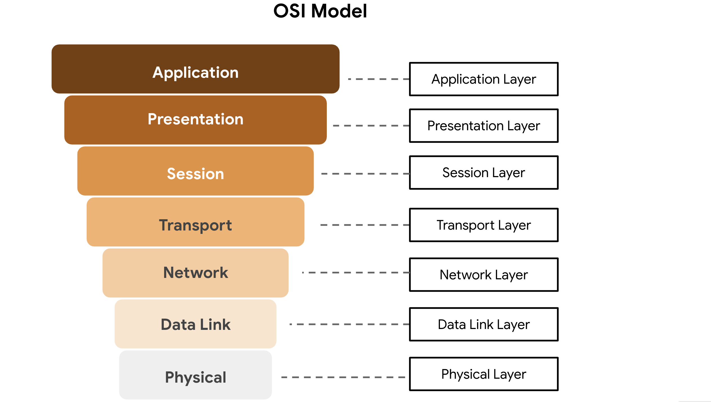

# The OSI Model

## Overview
In this section, you will learn about the OSI (Open Systems Interconnection) model, which provides a more in-depth understanding of network communication processes compared to the TCP/IP model. The OSI model consists of seven layers, each describing different network functions. Understanding the OSI model is crucial for network and security professionals to effectively diagnose and communicate network issues.

## TCP/IP Model vs. OSI Model
- **TCP/IP Model**:
  - Framework for visualizing data organization and transmission across a network.
  - Four layers: Network Access Layer, Internet Layer, Transport Layer, Application Layer.
  - Helps identify which layer an attack occurred based on the processes involved.
- **OSI Model**:
  - Standardized concept describing seven layers for network communication.
  - Often used by network and security professionals to communicate about potential problems or threats.
  - Provides a more detailed breakdown of network processes compared to the TCP/IP model.

## The Seven Layers of the OSI Model

### Layer 7: Application Layer
- **Function**: Direct user interaction with the network.
- **Protocols**:
  - **HTTP/HTTPS**: Used by web browsers to send and receive information from web servers.
  - **SMTP**: Used by email applications to send and receive email.
  - **DNS**: Translates domain names into IP addresses.
- **Example**: Using a web browser to access a website.

### Layer 6: Presentation Layer
- **Function**: Data translation and encryption for the network.
- **Processes**:
  - **Encryption**: SSL encrypts data between web servers and browsers.
  - **Compression**: Ensures data is in a standardized format for the receiving system.
- **Example**: Encrypting data for secure transmission over HTTPS.

### Layer 5: Session Layer
- **Function**: Establishes and maintains communication sessions between devices.
- **Responsibilities**:
  - **Authentication**: Verifies the identity of communicating devices.
  - **Checkpoints**: Ensures data transmission can resume from the last checkpoint if interrupted.
- **Example**: Managing an open session for a file transfer.

### Layer 4: Transport Layer
- **Function**: Delivers data between devices, handles data transfer speed and flow.
- **Protocols**:
  - **TCP**: Ensures reliable data transmission.
  - **UDP**: Connectionless protocol for real-time applications.
- **Example**: Segmentation of large data transmissions into smaller segments.

### Layer 3: Network Layer
- **Function**: Routes data packets between networks.
- **Components**:
  - **IP Addresses**: Indicate the destination of data packets.
  - **Routers**: Direct data packets to the correct network.
- **Example**: Routing data packets from one network to another.

### Layer 2: Data Link Layer
- **Function**: Organizes sending and receiving data packets within a single network.
- **Components**:
  - **Switches**: Manage data traffic within a local network.
  - **Network Interface Cards (NICs)**: Connect devices to the network.
- **Protocols**: NCP, HDLC, SDLC.
- **Example**: A switch directing data to the appropriate device on a local network.

### Layer 1: Physical Layer
- **Function**: Corresponds to physical hardware involved in network transmission.
- **Components**: Hubs, modems, cables, and wiring.
- **Process**: Translates data packets into a stream of 0s and 1s for transmission over physical media.
- **Example**: Ethernet cables transmitting data between devices.

## Key Takeaways
- Both the TCP/IP and OSI models are conceptual frameworks for understanding network processes and protocols.
- **TCP/IP Model**: Contains four layers and is widely used for internet communication.
- **OSI Model**: Contains seven layers, providing a more detailed breakdown of network functions.
- **Usage**: Network and security professionals use these models to diagnose issues and communicate about network disruptions or threats.

---

By understanding both models, network engineers and security analysts can effectively design, manage, and troubleshoot network processes, ensuring efficient data transmission and robust security protocols.

