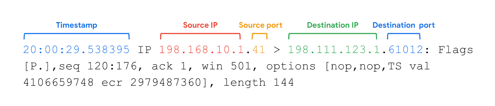

# Reading tcpdump Logs

## Network Protocol Analyzers

### Overview
A network protocol analyzer, also known as a packet sniffer or packet analyzer, is a tool designed to capture and analyze data traffic within a network. These tools are crucial for monitoring networks and identifying suspicious activity. Common analyzers include:

- SolarWinds NetFlow Traffic Analyzer
- ManageEngine OpManager
- Azure Network Watcher
- Wireshark
- tcpdump

This reading focuses on **tcpdump**, a command-line network protocol analyzer, though the skills discussed can be applied to other analyzers.

### What is tcpdump?
- **tcpdump** is a popular, lightweight command-line network protocol analyzer.
- Uses the open-source libpcap library.
- Preinstalled on many Linux distributions and compatible with Unix-based operating systems, such as macOS.
- Converts key information about network traffic into human-readable formats.
- Displays source IP addresses, destination IP addresses, and port numbers.

## Interpreting tcpdump Output

When tcpdump captures packets, it provides various pieces of information:

### Key Information in tcpdump Output:
1. **Timestamp**:
   - Format: hours, minutes, seconds, and fractions of a second.
2. **Source IP**:
   - The packet’s origin IP address.
3. **Source Port**:
   - The port number from where the packet originated.
4. **Destination IP**:
   - The IP address where the packet is being sent.
5. **Destination Port**:
   - The port number where the packet is being sent.

*Note*: By default, tcpdump attempts to resolve host addresses to hostnames and replace port numbers with commonly associated services.

### Common Uses of tcpdump:
1. **Capturing and Viewing Network Communications**:
   - Monitoring network traffic.
2. **Troubleshooting Network Performance Issues**:
   - Collecting statistics about network performance.
3. **Establishing a Baseline**:
   - Understanding normal network traffic patterns and utilization metrics.
4. **Detecting and Identifying Malicious Traffic**:
   - Recognizing anomalies and potential threats.
5. **Creating Customized Alerts**:
   - Setting up notifications for network issues or security threats.
6. **Locating Unauthorized IM Traffic or Wireless Access Points**:
   - Monitoring for unapproved network activities.

### Security Implications:
- Attackers can use network protocol analyzers maliciously to gain information about a network.
- They can capture data packets containing sensitive information, such as account usernames and passwords.
- Cybersecurity analysts must understand how to use these tools and recognize their potential misuse.

## Key Takeaways
- Network protocol analyzers like **tcpdump** are essential tools for monitoring and investigating network traffic.
- **tcpdump** is a command-line tool compatible with Linux/Unix and macOS, providing packet routing information.
- These tools help detect malicious activities but can also be exploited by attackers to capture sensitive data.
- Understanding how to interpret **tcpdump** logs is crucial for effective network security management.

