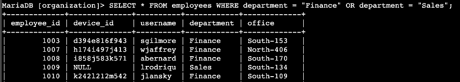

### Apply filters to SQL queries

#### Project Description

This project involves investigating security issues within an organization by using SQL to filter and retrieve specific data from its databases. The tasks include analyzing login attempts and employee data to identify potential security incidents and gather relevant information for system updates. Various SQL statements such as `SELECT`, `WHERE`, `AND`, `OR`, `NOT`, and `LIKE` are utilized to perform these operations. These SQL filters help in identifying failed login attempts, login activities on specific dates, and login attempts from specific locations, as well as retrieving employee information based on department and office location.

------

#### Retrieve after hours failed login attempts

**Query:**

```sql
SELECT * FROM log_in_attempts WHERE login_time > '18:00' AND success = FALSE;
```

**Explanation:** This query retrieves all records from the `log_in_attempts` table where the login time is after 18:00 (6 PM) and the login attempt was unsuccessful. The condition `login_time > '18:00'` filters for after-hours login attempts, and `success = FALSE` ensures only failed attempts are selected.


------

#### Retrieve login attempts on specific dates

**Query:**

```sql
SELECT * 
FROM log_in_attempts 
WHERE login_date = '2022-05-09' OR login_date = '2022-05-08';
```

**Explanation:** This query selects all records from the `log_in_attempts` table for the dates May 8 and May 9, 2022. The `OR` operator allows for the retrieval of records that match either of the specified dates, helping investigate login attempts around a suspicious event.


------

#### Retrieve login attempts outside of Mexico

**Query:**

```sql
SELECT * FROM log_in_attempts WHERE NOT country LIKE 'MEX%';
```

**Explanation:** This query fetches all login attempts from the `log_in_attempts` table where the country is not Mexico. The `NOT` operator excludes records where the `country` column starts with 'MEX', covering both 'MEX' and 'MEXICO'.

------

#### Retrieve employees in Marketing

**Query:**

```sql
SELECT * FROM employees WHERE department LIKE 'Marketing' AND office LIKE 'East%';
```

**Explanation:** This query retrieves all employees from the `employees` table who are in the Marketing department and are located in offices within the East building. The `LIKE` operator with `%` allows for pattern matching, ensuring all relevant offices in the East building are included.

------

#### Retrieve employees in Finance or Sales

**Query:**

```sql
SELECT * FROM employees WHERE department = 'Finance' OR department = 'Sales';
```

**Explanation:** This query selects employees from the `employees` table who work in either the Finance or Sales departments. The `OR` operator is used to include employees from both departments, facilitating the necessary security updates for these groups.



------

#### Retrieve all employees not in IT

**Query:**

```sql
sql
Copy code
SELECT * FROM employees WHERE NOT department LIKE 'Information%';
```

**Explanation:** This query fetches all employees from the `employees` table who are not in the Information Technology (IT) department. The `NOT` operator, combined with `LIKE 'Information%'`, excludes IT department employees from the results.


------

### Summary

This project demonstrates the use of SQL to investigate security incidents and manage employee information within an organization. By applying filters using `AND`, `OR`, and `NOT` operators, it is possible to identify failed login attempts after hours, analyze login activity on specific dates, and examine login attempts from outside Mexico. Additionally, employee data for targeted departments and buildings is retrieved to ensure comprehensive security updates. These tasks showcase the ability to leverage SQL for effective data filtering and security management.

